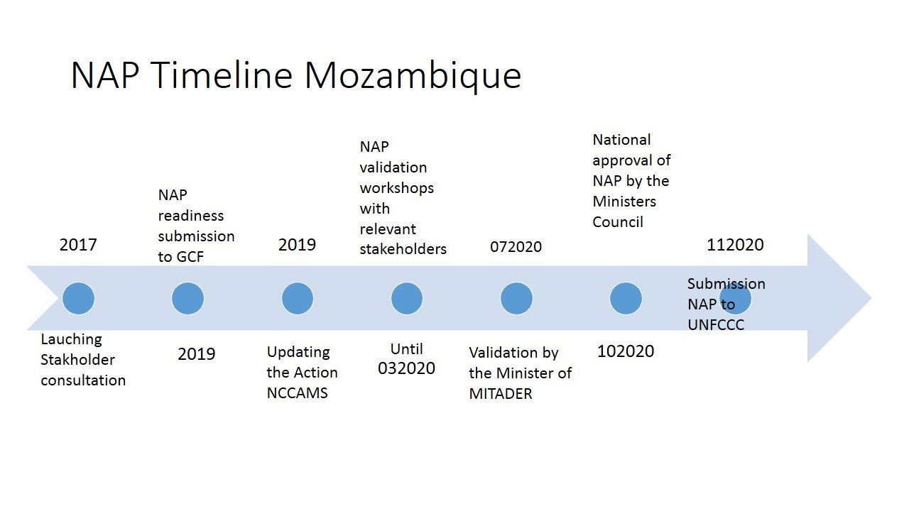

# Vision for adaptation for the country

```{r, include=FALSE}
knitr::opts_chunk$set(echo = FALSE, message = FALSE, warning=FALSE)
``` 

Goal and objectives of the NAP
Regulatory frameworks and institutional arrangements for adaptation
a. Governance structures/Institutions
Insert from National Climate Change Adaptation and Mitigation strategy 

b. Plans for integrating adaptation and NAPs in development planning and plans

NDC
PQG 20


Processes supporting the development of the National Adaptation Plan (could be placed after national circumstances)
a.	Description of decision-making processes and how adaptation options are prioritized
b.	Multi stakeholder engagement process
MITADER (coordinator), MEF (National Directorate of Planning and budgeting and Directorate of M&E),  MASA (DINAS, DNV,DINEA, IIAM,INDR); MOPHRH (DNGRH, Direcção De Obras Publicas); MAEF (INGC, Local Administrations), MGCAS (DINAS), Research institutions and Universities, Civil Society and Private Sector. 

c.	National roadmap and framework 




d.	Guiding principles (science, ITK, gender, transparency and participation, etc.) 

e.	Process of identification/stocktaking of desirable and available information
a.	Climate and socio economic data and information

b.	Current assessments: Exploring possibilities for further assessments


c.	Policies, strategies, plans

 
d.	Existing initiatives on adaptation


```{r}
library(flextable)
library(magrittr)
initiatives<-readxl::read_excel("Tables_from_NAP.xlsx", 
    sheet = "adpt-initiatives")
t1<-flextable(initiatives,col_keys = names(initiatives),
  cwidth = 3,
  cheight = 0.01,
  defaults = list(),
   theme_booktabs())
t2<-fontsize(t1,part = 'all', size = 8)
t3<-border_outer(t2,part = 'all', border = NULL)
t4<-border_inner(t3,part = 'all', border = NULL)
t5<-bold(t4,part='header')
t5
```


f.	Resource mobilization for the process


