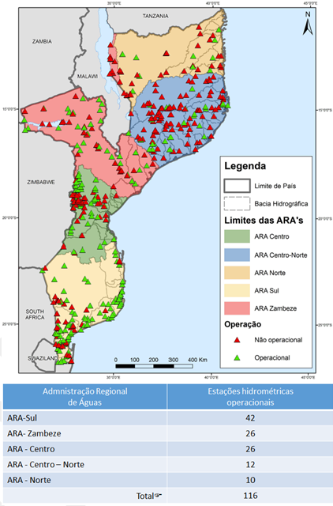
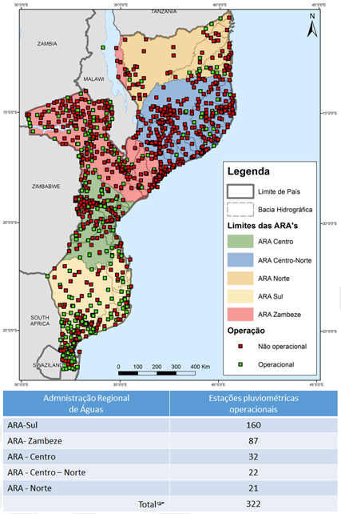
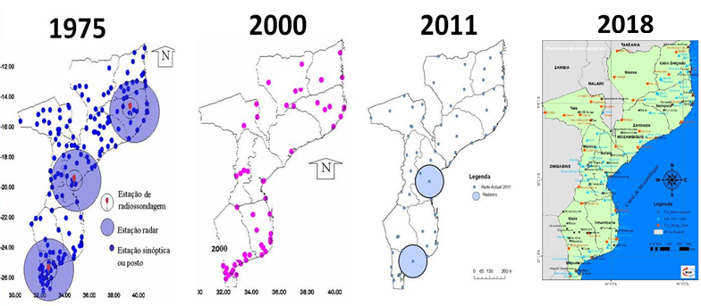
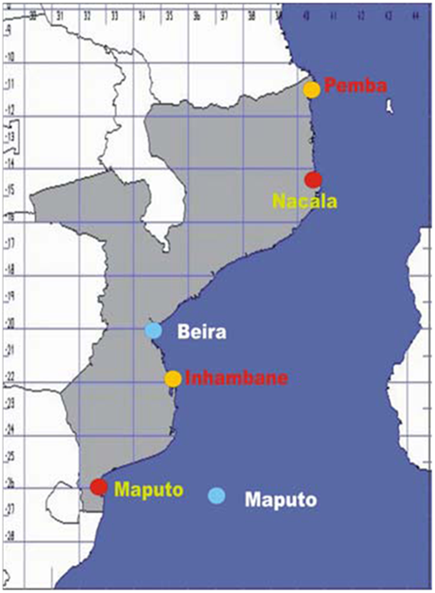

# National adaptation priorities

```{r, include=FALSE}
knitr::opts_chunk$set(echo = FALSE, message = FALSE, warning=FALSE)
``` 

*	Aumentar a 

 
(To address the key impacts, vulnerabilities and risks covering the economy, environment and the social including gender, covering all adaptation needs including those being addressed already – the national adaptation portfolio/the national adaptation effort)
a.	NAPA
b.	National Strategy of Gender Environment and  Climate Change  
c.	National Determined Contributions (NDC)
d.	Local Adaptations Plans (Covering 106 districts out of 152 districts)
e.	National Strategy of Basic Social Security 
f.	Strategic Plan of the Health Sector that include Climate Change  
g.	Action Plan for the Fishery Sector for Climate Change 
h.	Action Plan for Climate Resilient Agriculture 
Climate change adaptation implementation strategy including costs
a.	National climate change adaptation Strategy: umbrella programme


b.	Projects and programmes to address key risks for the country

```{r}
library(flextable)
library(magrittr)
projects<-readxl::read_excel("Tables_from_NAP.xlsx", 
    sheet = "risk-projects")
t1<-flextable(projects,col_keys = names(projects),
  cwidth = 3,
  cheight = 0.01,
  defaults = list(),
   theme_booktabs())
t2<-fontsize(t1,part = 'all', size = 8)
t3<-border_outer(t2,part = 'all', border = NULL)
t4<-border_inner(t3,part = 'all', border = NULL)
t5<-bold(t4,part='header')
t5
```


c.	Essential cross-cutting projects/programmes
i.	Creating an effective adaptation process and system (mainstreaming/integration, policies, governance, etc.)

ii.	Climate information services and early warnings systems, systematic observations

O Instituto Nacional de Meteorologia de Moçambique (INAM) é a principal instituição responsável pela colecta, tratamento e arquivo de dados meteorológicos e climáticos em Moçambique. O INAM faz a colecta de dados meteorológicos a partir sua rede de estações meteorológicas que são operadas em todo o país. O INAM tem mandato para fornecer informações meteorológicas para apoiar o planeamento, bem como para fornecer aviso prévio, sempre que necessário, para minimizar riscos de vida e bens. O INAM fornece várias previsões e produtos meteorológicos diferentes ao longo do ano, incluindo, entre outros, previsões meteorológicas diárias e sazonais, observações meteorológicas e climáticas e produtos especializados para os sectores da aviação e marinha. As previsões públicas emitidas pelo INAM incluem três previsões diárias - duas previsões de 24 horas emitidas pela manhã e tarde, respectivamente, mais uma previsão de 'quatro dias' emitida todas as manhãs. Além das previsões diárias transmitidas pela Comunicação Social, como notícias nacionais e a página do INAM, o Instituto prepara previsões agrícolas sazonais para cada província que são apresentadas no início da temporada agrícola, geralmente em Setembro (ou seja, nas semanas anteriores ao início da a estação das chuvas, quando os agricultores começam a preparar suas terras).

__Observações hidrológicas__  

As Administrações Regionais de Água (ARAs - Sul, Centro, Centro Norte, Norte e Zambeze) e a Direcção Nacional de Gestão dos Recursos Hídricos (DNGRH) são instituições sob tutela do Ministério das Obras Públicas, Habitação e Recursos Hídricos (MOPHRH) que fazem a provisão de dados hidrológicos e de precipitação ao mesmo tempo que garantem os serviços de informação hidrológica para apoiar o planeamento e gestão de recursos hídricos na monitoria e análise das alterações climáticas, gestão ambiental e planeamento, operações hidroeléctricas e barragens, planeamento de sistemas de irrigação e aviso prévio de desastres relacionados com a água. Os principais temas dos serviços hidrológicos são: 
(i)	Planeamento de recursos hídricos e alocação;
(ii)	 Gestão operacional de infra-estruturas hidráulicas; 
(iii)	Gestão ambiental; 
(iv)	Avaliação de risco de inundação, Planeamento de Redução de Risco e Controlo de Cheias;
(v)	Gestão de Seca no sistema de aviso prévio;
(vi)	Gestão da poluição;
(vii)	Mudança climática; 
(viii)	Gestão da irrigação.

__Observações agro-climáticas__ 

O Instituto de Investigação Agrária de Moçambique (IIAM), subordinada ao MASA, é a principal instituição de pesquisa agrícola de Moçambique. O IIAM está focalizado, principalmente, em pesquisa e desenvolvimento para apoiar a produtividade e eficiência do sector agrícola de Moçambique, particularmente, através da geração de produtos de pesquisa local e oportuna para informar às partes interessadas em toda a cadeia de valor agrícola. O IIAM também é responsável pela comunicação de informações técnicas pertinentes às partes interessadas relevantes para o sector agrícola, os decisores políticos do governo, os extensionistas e agricultores ao nível do campo. O foco da pesquisa do IIAM inclui ciências agronómicas, florestais e animais, sociologia rural e economia e agronegócios, que é realizado com o objectivo de fornecer orientação científica, técnica e administrativa ao MASA e a outras instituições públicas envolvidas no sector agrícola.

__Observações oceanográficas e monitorização do nível do mar__  

O Instituto Nacional de Hidrografia e Navegação (INAHINA) é uma instituição tutelada pelo Ministro que superintende o sector dos Transportes Marítimos e é parte integrante do Ministério dos Transportes e Comunicações. A função principal do INAHINA é de facilitar a navegação segura nas águas costeiras e interiores do país, através de serviços hidrográficos, oceanográficos assim como instalação, reabilitação e manutenção de ajudas à navegação incluindo a calibração de agulhas magnéticas. A observação e monitorização do nível do mar faz parte de uma das suas atribuições no domínio da coordenação, cooperação, desenvolvimento e acompanhamento de actividades de investigação, estudos e trabalhos no domínio de Hidrografia, Cartografia Náutica, Oceanografia e Navegação. Estudos sobre elevação do nível do mar (SLR) vêm sendo realizados no INAHINA, INAM e ao nível da academia (p. ex. UEM). Até agora, a avaliação realizada foi baseada em dados históricos medidos a partir de marégrafos e altimetria de satélites. Não obstante, um estudo conduzido pelo Instituto Nacional de Gestão de Calamidades (INGC, 2009) em parceria com instituições nacionais, regionais e internacionais fez uma avaliação, combinando a abordagem histórica e projecções climáticas da elevação do nível do mar usando cenários descritos no IPCC (2007) conhecidos como SRES . Dados observacionais mais actualizados e projecções de elevação do nível do mar (SLR) tendo em conta cenários mais recentes precisam de ser considerados para uma avaliação mais consistente. 

__Observações de dados oceano-físico-biológicos e monitorização da ocorrência de recursos pesqueiros__  

O Instituto Nacional de Investigação Pesqueira (IIP) é uma instituição pública subordinada ao Ministério do Mar, Águas Interiores e Pescas (MIMAIP) e que desenvolve trabalhos de investigação necessários ao conhecimento científico dos recursos pesqueiros das águas jurisdicionais moçambicanas tendo em vista a sua gestão, conservação e optimização da sua exploração. O IIP realiza cruzeiros de investigação pesqueira que permitem fazer a monitorização científica da ocorrência de recursos pesqueiros nas águas jurisdicionais moçambicanas e a medição dos parâmetros físicos e químicos do meio aquático, onde estes recursos habitam. A informação produzida através destes cruzeiros complementa os dados colhidos da actividade de pesca comercial e de subsistência é usada para avaliar o grau de exploração dos recursos com vista à gestão sustentável das pescarias. Através de cruzeiros de investigação são colhidos dados oceanográficos (CTD), dados de nutrientes, sedimentos, ventos, correntes, produtividade primária, mamíferos marinhos entre outros.


__Monitoria e vigilância em saúde pública__

O Observatório Nacional de Saúde (ONS) é uma instituição de âmbito nacional, subordinada ao Ministério da Saúde (MISAU). O ONS é centro nacional virtual concebido para a observação sistemática e fortalecimento do sistema de informação de saúde nacional. Com alicerces nas suas atribuições o ONS tem centrado as suas actividades, desde a sua criação em 2015, na análise de dados secundários com base na triangulação das fontes de dados de modo a “informar para acção” e assegurar o bem-estar da população. O ONS faz a integração: (i) de dados de diferentes fontes nomeadamente, de ministérios, instituições de pesquisa, ONGs, sociedade civil e instituições académicas; (ii) das funções de sistemas de informação, monitoria e vigilância em saúde já estabelecidos (por ex., CISM, INS). O ONS recomenda, sempre necessário, a produção de informação primária às entidades com este mandato. O ONS funciona através de plataformas multi-institucionais e multidisciplinares (HIV; Saúde da Mulher e Criança e Nutrição; Clima, Ambiente e Saúde; Mortalidade; Resistência Anti-microbiana; Sistemas de Saúde e PACE) que formam a rede de gestão do conhecimento. Através da plataforma de Clima, Ambiente e Saúde a instituição participa no Fórum Nacional de Antevisão Climática (FNAC), onde são produzidos, anualmente, mapas de risco de doenças sensíveis ao clima para a época chuvosa seguinte. Os principais indicadores usados na FNAC estão divididos em categorias nomeadamente: socio-demográficos, saúde – programáticos, meteorológicos/climáticos e ambientais.

__Instituições utilizadoras de informações/dados observacionais__
A Tabela 5.8 mostra algumas instituições utilizadoras de informações/dados meteorológicas (os) e hidrológicas (os) entre outras (os) fornecidas (os) pelas instituições provedoras incluindo a sua finalidade e prioridade de uso.  

Tabela 5.9: Papel das instituições utilizadoras de informações/dados meteorológicos (os) e hidrológicas (os) provenientes das instituições provedoras ( MOPHRH, 2016).

```{r}
library(flextable)
library(magrittr)
met.inst<-readxl::read_excel("Tables_from_NAP.xlsx", 
    sheet = "met-instit")
t1<-flextable(met.inst,col_keys = names(met.inst),
  cwidth = 3,
  cheight = 0.01,
  defaults = list(),
   theme_booktabs())
t2<-fontsize(t1,part = 'all', size = 8)
t3<-border_outer(t2,part = 'all', border = NULL)
t4<-border_inner(t3,part = 'all', border = NULL)
t5<-bold(t4,part='header')
t5
```


###	Estágio actual das observações em Moçambique
A rede de observações sistemáticas em Moçambique sofreu uma degradação progressiva depois da independência até aos anos 2000. Depois das cheias de 2000 houve investimentos nacionais e de parceiros internacionais que permitiram que actualmente a rede de observações esteja melhor do que o período anterior ao ano 2000, pese embora a sua representatividade espacial continua deficiente. Foram introduzidos neste período novos sistemas de observação automáticos, no entanto este processo não foi adequadamente acompanhado pela formação de pessoal qualificado para garantir sua manutenção, isto agravado pelo facto de os orçamentos não garantirem verbas suficientes para este exercício.     
A melhoria dos serviços hidro-meteorológicos de Moçambique tem um potencial para aumentar a produtividade em sectores como a agricultura, pesca/marinha, energia hidroeléctrica, aviação, transporte rodoviário, planificação de infra-estruturas e na saúde. A informação hidro-meteorológica pode aumentar a produtividade desses sectores-chave da economia, fornecendo conhecimento que se pode traduzir num incremento da produção económica, através de uma melhor planificação e gestão adequada das infra-estruturas.
O papel dos serviços hidro-meteorológicos fornecidos pelas ARAs, a DNGRH e o INAM é reconhecido em vários pacotes legislativos, estratégias e políticas do Governo em Moçambique. Porém, a eficácia dos serviços no cumprimento do seu papel tem sido prejudicada por uma série de desafios caracterizada pela baixa densidade de estações pluviométricas (muitas necessitando de reabilitação e calibração) e diferentes níveis de soluções tecnológicas. Para qualquer das instituições não houve algum projecto sistemático de desenvolvimento da rede e, a localização das estações limita-se às sedes provinciais e distritais, bem como locais estratégicos, como aeroportos, postos experimentais agronómicos e partes da costa. Não obstante, a DNGRH e O INAM estão a liderar a implementação de um estudo de optimização da rede e serviços hidro-meteorológicos (MOPHRH, 2016), com o objectivo de desenhar intervenções necessárias que levarão à sua melhoria do seu funcionamento no país.

__Rede de observações hidrológicas__

Segundo os dados hidrológicos utilizados e fornecidos pelas 5 Administrações de Águas (ARAs) e confirmados pela base de dados central da DNGRH e analisados no relatório do estudo realizado pela empresa de consultoria SOLOMON durante a fase de diagnóstico dos serviços hidro-meteorológicos (MOPHRH, 2016), existe um total de 116 estações operacionais pertencentes aquelas entidades (Figura 5.2). Segundo este relatório, as observações hidrológicas colhidas a partir das estações hidrométricas das ARAs e DNGRH cobrem o período de 1930 a 2014, com particular destaque para o período de 1942 a 1981, onde o número de estações operacionais aumentou significativamente.  



Na rede de monitoramento de dados de precipitação foi constatada a existência de um total de 322 estações operacionais pertencentes a DNGRH e ARAs (Figura 5.3).  




__Rede de observações meteorológicas e climáticas__
O INAM opera a principal rede de observações meteorológicas e climáticas do país. Os mapas abaixo (Figura 5.4) e a Tabela 5.8 e ilustram a evolução da rede com o tempo, usando como referência os anos 1975, 2000, 2011 e 2018 e a sua distribuição espacial. Como se pode notar entre 1975 e 2000 houve uma queda geral acentuada da rede nacional de observações gerida pelo INAM. Entre 2000 e 2011 houve progresso com aumento significativo das estações sinópticas e instalação de dois radares tempo, modernos, como resultado de investimentos significativos mobilizados em resposta às devastadoras cheias do ano 2000. Entre 2011 e 2018 houve um incremento mais significativo dos vários tipos de estações da rede de observação do INAM.

 

Tabela 5.10: Número das estações sinópticas, climatológicas e agro-climáticas operacionais e não operacionais do INAM


```{r}
library(flextable)
library(magrittr)
stations<-readxl::read_excel("Tables_from_NAP.xlsx", 
    sheet = "met-stations")
t1<-flextable(stations,col_keys = names(stations),
  cwidth = 3,
  cheight = 0.01,
  defaults = list(),
   theme_booktabs())
t2<-fontsize(t1,part = 'all', size = 8)
t3<-border_outer(t2,part = 'all', border = NULL)
t4<-border_inner(t3,part = 'all', border = NULL)
t5<-bold(t4,part='header')
t5
```


Rede de observações agro-climáticas
O IIAM é a principal instituição agrária nacional que se dedica à investigação nas áreas agrícola e pecuária, tendo uma rede actualmente composta de 2 estações climatológicas, 17 agro-climáticas, 3 odométricas, conforme mostra a Tabela 5.11 Destas estações apenas 12 estão operacionais, no entanto com equipamento obsoleto que não é calibrado há bastante tempo.  

Tabela 5.11: Rede de estações do IIAM


```{r}
library(flextable)
library(magrittr)
IIAM<-readxl::read_excel("Tables_from_NAP.xlsx", 
    sheet = "IIAM")
t1<-flextable(IIAM,col_keys = names(IIAM),
  cwidth = 3,
  cheight = 0.01,
  defaults = list(),
   theme_booktabs())
t2<-fontsize(t1,part = 'all', size = 8)
t3<-border_outer(t2,part = 'all', border = NULL)
t4<-border_inner(t3,part = 'all', border = NULL)
t5<-bold(t4,part='header')
t5
```


__Rede de observações do nível do mar__
O Instituto Nacional de Hidrografia e Navegação (INAHINA) é a instituição moçambicana (subordinada ao Ministério dos Transportes e Comunicações), responsável pela instalação e manutenção das estações de marés, bem como pela aquisição, processamento, arquivo e disseminação dos dados do nível do mar. Esta instituição possui uma rede composta por treze estações de observação do nível do mar, das quais apenas quatro (Maputo, Inhaca, Inhambane, Beira, Quelimane, Chinde e Pemba) estão actualmente em funcionamento, o que significa que a manutenção, aquisição, processamento, arquivo e disseminação estão sendo feitos apenas para essas estações. Os registos mais antigos datam dos anos 70. A Figura 5.6 mostra o mapa de Moçambique com as estações maregráficas do INAHINA operacionais. O processamento de dados está sendo realizado de acordo com os padrões internacionais, com base nos procedimentos básicos de medição e interpretação do nível do mar (UNESCO, 1985). Para padronizar a rede de marés, em 2005, Moçambique actualizou duas estações GLOSS em Pemba e Inhambane, durante o projecto ODINAFRICA III, em colaboração com o INAHINA, SANHO e POL. O projecto foi financiado pelo IOC, e a principal proposta dessa actualização foi registar o nível do mar para monitorar as zonas costeiras e os impactos das mudanças globais em África, fornecendo observações quase em tempo real do nível do mar. 

A principal razão para o não funcionamento regular da rede dos marégrafos se prende com a danificação de algumas estações maregráficas e equipamento por operadores portuários, particularmente, em Maputo, Beira e Pemba; a obsolência de alguns equipamentos; falta de operadores qualificados e fraca manutenção da instrumentação oceanográfica. Falta de actualização dos programas/softwares e equipamentos para observação, processamento e validação de dados oceanográficos. Em suma, o número de pontos de observação oceanográfica permanente para uma costa de cerca de mais de 2,700 km mostra-se bastante reduzido.    

 


__Banco de dados__
A política de acesso livre e facilitado aos dados meteorológicos essenciais, para a prestação de um serviço público de excelência defendida pelas instituições provedoras de dados de interesse público arquivam séries históricas das várias estações convencionais da rede de estações e de outras fontes de observação com várias informações, referentes às medições diárias, de acordo com as normas e técnicas internacionais das organizações internacionais afiliadas. A maioria das instituições está empenhada na gestão da base de dados e vem progressivamente fazendo digitalização dos dados históricos com o apoio e financiamento de instituições financeiras. As Tabelas 5.12a-f que se seguem abaixo mostram as variáveis arquivadas nos diferentes bancos de dados das instituições que realizam observações sistemáticas em Moçambique 

Tabela 5.12a: Tipo de dados observados no INAM 

```{r}
library(flextable)
library(magrittr)
INAM<-readxl::read_excel("Tables_from_NAP.xlsx", 
    sheet = "INAM-obs")
t1<-flextable(INAM,col_keys = names(INAM),
  cwidth = 3,
  cheight = 0.01,
  defaults = list(),
   theme_booktabs())
t2<-fontsize(t1,part = 'all', size = 8)
t3<-border_outer(t2,part = 'all', border = NULL)
t4<-border_inner(t3,part = 'all', border = NULL)
t5<-bold(t4,part='header')
t5
```


Tabela 5.12b: Tipo de dados observados no IIAM 

```{r}
library(flextable)
library(magrittr)
IIAM_obs<-readxl::read_excel("Tables_from_NAP.xlsx", 
    sheet = "IIAM-obs")
t1<-flextable(IIAM_obs,col_keys = names(IIAM_obs),
  cwidth = 3,
  cheight = 0.01,
  defaults = list(),
   theme_booktabs())
t2<-fontsize(t1,part = 'all', size = 8)
t3<-border_outer(t2,part = 'all', border = NULL)
t4<-border_inner(t3,part = 'all', border = NULL)
t5<-bold(t4,part='header')
t5
```


Tabela 5.12c: Tipo de dados observados na DNGRH


```{r}
library(flextable)
library(magrittr)
DNGRH<-readxl::read_excel("Tables_from_NAP.xlsx", 
    sheet = "DNGRH-obs")
t1<-flextable(DNGRH,col_keys = names(DNGRH),
  cwidth = 3,
  cheight = 0.01,
  defaults = list(),
   theme_booktabs())
t2<-fontsize(t1,part = 'all', size = 8)
t3<-border_outer(t2,part = 'all', border = NULL)
t4<-border_inner(t3,part = 'all', border = NULL)
t5<-bold(t4,part='header')
t5
```

Tabela 5.12d: Tipo de dados observados na INAHINA

```{r}
library(flextable)
library(magrittr)
INAHINA<-readxl::read_excel("Tables_from_NAP.xlsx", 
    sheet = "INAHINA-obs")
t1<-flextable(INAHINA,col_keys = names(INAHINA),
  cwidth = 3,
  cheight = 0.01,
  defaults = list(),
   theme_booktabs())
t2<-fontsize(t1,part = 'all', size = 8)
t3<-border_outer(t2,part = 'all', border = NULL)
t4<-border_inner(t3,part = 'all', border = NULL)
t5<-bold(t4,part='header')
t5
```


Tabela 5.12e: Tipo de dados observados no IIP

```{r}
library(flextable)
library(magrittr)
IIP<-readxl::read_excel("Tables_from_NAP.xlsx", 
    sheet = "IIP-obs")
t1<-flextable(IIP,col_keys = names(IIP),
  cwidth = 3,
  cheight = 0.01,
  defaults = list(),
   theme_booktabs())
t2<-fontsize(t1,part = 'all', size = 8)
t3<-border_outer(t2,part = 'all', border = NULL)
t4<-border_inner(t3,part = 'all', border = NULL)
t5<-bold(t4,part='header')
t5
```


Tabela 5.11f: Tipo de dados observados no ONS

```{r}
library(flextable)
library(magrittr)
ONS<-readxl::read_excel("Tables_from_NAP.xlsx", 
    sheet = "ONS-obs")
t1<-flextable(ONS,col_keys = names(ONS),
  cwidth = 3,
  cheight = 0.01,
  defaults = list(),
   theme_booktabs())
t2<-fontsize(t1,part = 'all', size = 8)
t3<-border_outer(t2,part = 'all', border = NULL)
t4<-border_inner(t3,part = 'all', border = NULL)
t5<-bold(t4,part='header')
t5
```

 

__Sistema nacional de aviso prévio__  

O sistema nacional de aviso prévio em Moçambique é coordenado pelo Instituto Nacional de Gestão de Calamidades (INGC), por intermédio do Centro Nacional Operativo de Emergência (CENOE). Este organismo, como coordenador de acções ligadas à emergência e resposta a desastres funciona com 3 níveis de vigilância, nomeadamente: vigilância sem alerta, alerta parcial e alerta total. No primeiro nível de alerta, O CENOE conta com um sistema permanente de oficiais de serviço, exercendo as funções de recolha e processamento de informação em coordenação estreita com os sectores listados na Tabela 5.13 e outros julgados pertinentes.  

Tabela 5.13: Instituições intervenientes no Sistema de Aviso Prévio e suas funções

```{r}
library(flextable)
library(magrittr)
EWS<-readxl::read_excel("Tables_from_NAP.xlsx", 
    sheet = "early-warning-inst")
t1<-flextable(EWS,col_keys = names(EWS),
  cwidth = 3,
  cheight = 0.01,
  defaults = list(),
   theme_booktabs())
t2<-fontsize(t1,part = 'all', size = 8)
t3<-border_outer(t2,part = 'all', border = NULL)
t4<-border_inner(t3,part = 'all', border = NULL)
t5<-bold(t4,part='header')
t5
```


Este sistema de aviso prévio funciona, particularmente, durante a época de maior frequência de eventos de tempo e clima que possam contribuir para ocorrência de desastres (período chuvoso em Moçambique, Outubro-Abril). Neste período, o CENOE organiza reuniões semanais de coordenação. No entanto, o sistema é generalizado, isto é, não responde efectivamente a situações de nível local. Para colmatar este aspecto, o INGC em colaboração com instituições nacionais e internacionais está em processo de estabelecimento de sistemas de aviso prévio dirigido a certas áreas de maior risco. Um exemplo desta colaboração é o estabelecimento do sistema de aviso prévio para as bacias hidrográficas, onde se destaca o sistema de aviso prévio nas bacias dos rios Búzi e Save (INGC, 2009). 


iii.	Active monitoring of key systems: crop production, water resources, ecosystems, etc


iv.	M&E system – individual projects and in aggregate for the country

v.	Capacity development for implementation of adaptation and support to the process including data and information management, etc

d.	Mobilization of resources
i.	Aligned with the GCF country programme, 

ii.	Other relevant climate finance mechanisms (international  and domestic) and implementing partners

•	GEF
•	AF
•	OGE
•	Grupo de Parceiros do Ambiente
•	Parceria da NDC
•	Bilaterais

iii.	Technology

iv.	Capacity-building
Reporting, monitoring and evaluation framework
a.	Monitoring and evaluation system (mapped to goals and objectives, and targets where applicable; 5 types of metrics: inputs, process, output, outcome, impact)
ICAT (Sistema 
Portal da NDC
Plataforma de Gestão Integrada de Mudanças Climáticas

b.	Reporting on progress on NAPs under the UNFCCC (through national communications/Adaptation Communications)

c.	Link to the NDC
d.	Reporting and outreach at the national level
Further development of an effective NAP process and updates to the NAP
a.	Data and system observations to support future assessments
b.	Roadmap (plan) for review and update of the NAP in five years 
c.	Addressing gaps and needs


